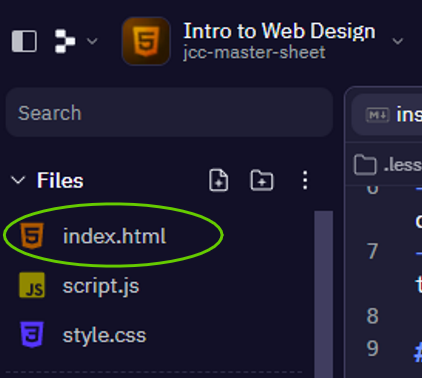
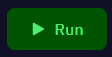

# Introduction to Web Design 📚

## What is Replit? 
- Replit is a San Francisco based start-up and an online IDE *(Integrated Development Environment.)*
- Replit allows users to create online projects in any programming language `(HTML, CSS, PYthon, JavaScript)` etc.
- Replit has a global community where programmers can talk, learn, and collaborate *(work together)* online.
- Replit is also used in schools through *"Replit Teams for Education"*, a tool used to teach programming in the classroom.

# My First Webpage 👨‍💻

## Part A:
- We are going to use `index.html` to write our program.
- It's located in the left hand console as shown:



- Type the lines of code below into `index.html`, be careful of spelling mistakes and any *"syntax"* errors.

````html
<!DOCTYPE html>
<html>
<head>
<title>My First Webpage</title>
</head>
<body>

<h1>This is a Heading</h1>
<p>This is a paragraph.</p>

</body>
</html>

````

- Now we are going to run our code to see how it looks in our *"Webview Browser"*.

- Click on the green *"RUN"* button at the top of the screen.


- Your new webpage will appear in the *"Webview Browser"* on the right.

## Questions to make you think 🤔 ?
1. What does your webpage look like?
2. How does your new webpage compare to other websites you use?

## ✍ Task:
- In your copy I want you to write down ``5 things`` that a good webpage should have.


## Part B:

1. Now we are going to add some more code to our program in `index.html`.

   - Again be careful of spelling mistakes and any *"syntax"* errors.

````html
<p>This is a paragraph.</p>
<p>This is another paragraph.</p>
````

2. What do these line of code do?
3. Can you edit the paragraphs to say something new?

5. Now let's try to change the colour of our webpage:
   
````html
<body style="background-color:powderblue;">
````
<details>
  <summary> 👀Hint </summary>

Tomato 
  
DodgerBlue

Orange

MediumSeaGreen

Violet
</details>

💡*Note: You can use this link for more information on colours in HTML ->* [W3schools Colour PIcker](https://www.w3schools.com/html/html_colors.asp)

>

6. Finally let's try to change the font colour.

    - Edit your ``<h1> heading`` and one of your ``<p> paragraphs`` with the following code:
````html
<h1 style="color:blue;">This is a heading</h1>
<p style="color:red;">This is a paragraph.</p>
````


## ✨Extra Credit
1. If you have time, we could try to change the font _"style"_ of one of our headings and a paragraph.

````html
<h1 style="font-family:verdana;">This is a heading</h1>
<p style="font-family:courier;">This is a paragraph.</p>
````

2. If you have ever programmed before, you'll know that adding `comments` is a very important part of writing good code.
    - `comments` allow other people to read and understand what our code is doing.
    - Good `comments` can help them to _de-bug_ 🐛 any possible errors we might have. 

👉 Can you find a way to add comments to your `index.hmtl` file above? 

<details>
  <summary> 👀 Hint </summary>

````html
<!---->
````
</details>

👉 Can you add a comment to show which line of code changes the background colour?

>


  