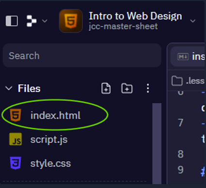

# Web Design - Day 2 👨‍💻

- Just like last week, we are going to use `index.html` to write our program.
- Remember, it's located in the left hand console as shown:



- Type the lines of code below into `index.html`, be careful of spelling mistakes and any *"syntax"* errors.
````html
<!doctype html>
<html>

<head>

  <title>My Second Webpage</title>
</head>

<!--why does this text not appear?-->

<body bgcolor="#FF6000">
  <h1 align="center">My Second Webpage</h1>
  <p>Welcome to my <strong>second</strong> webpage. I am writing this page using Replit.</p>
  <p>By learning html, I'll be able to create my own web pages.<br></p>
</body>

</html>
````
- Now we are going to run our code to see how it looks in our *"Webview Browser"*.

- Click on the green _**"Run"**_ button at the top of the screen.
 

- Your new Webpage will appear in the *"Webview Browser"* on the right.


## Task 1 🕵️‍♂️
- We are going to experiment with the different ``color codes`` and change the colour of your webpage.

- We can use w3schools [HTML Color Picker](https://www.w3schools.com/colors/colors_picker.asp) to look up a huge array of color codes.
- Have you noticed anything about the different spelling of *"colour"* and *"color"* yet?


## Task 2 🕵️‍♂️

- Now type the following code into the `index.html`, beneath your last paragraph.

````html
Here's what I've learned today:
<ul>
<li>How to use HTML tags</li>
<li>How to use HTML colours</li>
<li>How to create Lists</li>
<li>How to change the background colour</li>
</ul>
````

## Predict... 🤔
- What do you think this code will do?
- ✍ Write down your prediction before you click _**"Run"**._


## Task 3 🕵️‍♂️

- Again let's try to change the font colour.
- Edit your ``<h1> heading`` and one of your ``<p> paragraphs`` with the following code:

````html
<h1 style="color:blue;">This is a heading</h1>
<p style="color:red;">This is a paragraph.</p>
````

- Can you do this using the [HTML Color Picker](https://www.w3schools.com/colors/colors_picker.asp) ?
	
## Task 4 - Adding an Image 📸
- Now I want you to select a photo from _Google Images_.
- Click on the _**URL**_ for the image, this is it's address _(where we can find it online)._
- Using the code below, add your selected image into your webpage.

````html

````

## 🎉Woohoo!
- Now we can add an image into our Webpage, well done. 😎

  
