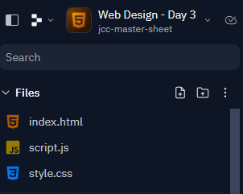

# Web Design - Day 3 📚

## Introduction
- Just like last week, we are going to use `index.html` to write our program.
- It's located in the left hand console as shown:
  



- Type the lines of code below into `index.html`, be careful of spelling mistakes and any *"syntax"* errors.
- Chat to the person sitting beside you about what the code does.

````html
<!DOCTYPE html>

<html>

<body bgcolour="#ffff66">

  <h1> Web Design - Day 3</h1>
  <p>Can you believe this is Day 3 of Web Design already!</p>


</body>

</html>
````
## Challenges 👨‍💻

1. Can you find the bug 🐛 that's keeping the background colour white?
2. Display a different background colour _(don't use a word...eg red, blue etc)._
3. Display a different font type.
4. Display a different font size.


## PRIMM 📚

PRIMM stands for _Predict, Run, Investigate, Modify, Make._

In each of the tasks below, I want you to chat to your classmates and check your predictions before running your code. 

👉 How many can you get correct?

# Tasks 🕵️‍♂️

- Below you will be given a bunch of tasks to complete.
- Each task will alter your webpage and introduce a new feature / element of it's design.

## Task 1
Add the following code to the appropriate section of the `index.html` and explain what it does.
````html
  <h5 align="left">I can align headings </h5>
  <h5 align="center">This is a centered heading </h5>
  <h5 align="right">This is a heading aligned to the right </h5>
````

## Task 2
Extend the program further by adding the following code:
````html
  <ol>
    <li>Coffee</li>
    <li>Milk</li>
  </ol>
````
👉 Can you add more items to the list?

## Task 3
Adding the following code creates something different:
````html
  <ul>
    <li>Coffee</li>
    <li>Milk</li>
  </ul>
````
👉 Can you spot the difference?

## Task 4
The following code is used for _description lists_ or _definitions_:
````html
<p>These three elements are used to create a description list:</p>

<dl>
  <dt>Coffee</dt>
  <dd>Is a black hot drink.</dd>
  <dt>Milk</dt>
  <dd>Is a white cold drink.</dd>
</dl>
````

## Task 5
Add the following code, what does it do?
````html
hello
hello<br>
hello<br>
hello<br>
hello<br>
hello<br>
hello<br>
hello<br>
hello<br>
hello<br>
hello<br>
hello<br>
hello<br>
hello<br>
hello<br>
hello<br>
hello<br>
hello<br>
hello<br>
hello<br>
hello<br>
hello<br>
hello<br>
hello<br>
hello<br>
hello<br>
````

## Task 6
This is a pretty cool feature, add it beneath the previous lines of code.

Can you think of a use for this in your webpage? 🤔
````html
<a href="#top">What does this do - click me and see </a>
````

## Task 7
Now let's expand our code further by adding in a table!

````html
<h2>The Table element</h2>

<table>
  <tr>
    <td>January</td>
    <td>$100</td>
  </tr>
  <tr>
    <td>February</td>
    <td>$80</td>
  </tr>
</table>
````

# Task 8 
Add the following attribute _(code)_ inside the table-tag above.

````html
<table border="2">
````
👉 What happens if you change the value from  `"2"` to `"5"`?

# Task 9
Now I want you to add the following code beneath your revised table-tag from above.

````html
  <tr>
    <th>Month</th>
    <th>Savings</th>
  </tr>
````

# Task 10
Lastly, let's expand your table attributes by also including the following:
````html
<table cellpadding="10">
````
👉 Again, can you _Predict_ what will happen if you change the value of `cellpadding="10"`? 
