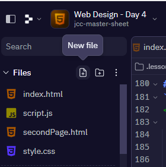

# Web Design - Day 4 📚


## Introduction
- Just like last week, we are going to use `index.html` to write our program.
- Type the lines of code below into `index.html`, be careful of spelling mistakes and any *"syntax"* errors.
- Chat to the person sitting beside you about what the code does.

````html
<!DOCTYPE html>

<html>
<head>
  <title> Web design - Day 4</title>
</head>
  
<body bgcolor="lime">

  <h1> Web Design - Day 4</h1>
  <p>We are going to be learning about the following elements today:</p>

  <ul>
    <li> Tables </li>
    <li> Borders and Padding </li>
    <li> Columns and Rows </li>
    <li> Buttons </li>
    <li> User Inputs </li>

  </ul>
</body>

</html>
````

# Section A - Tables

Last week we looked at creating a simple table using the `<table>` tag.

- Today we are going to explore the table attributes _(code)_ in more detail to make a more complex table.
- Again, be careful when typing up your code and make sure you close all your tags using `>`.

### 👉 Type up the code below and see if you can _PREDICT_ what it will do. 🤔

````html
<h2>More About Tables</h2>

<p>The following table looks at the amount of snowfall in Ireland over the last 3 months</p>

<table>
  <tr>
    <td>January</td>
    <td>3cm</td>
  </tr>
  <tr>
    <td>February</td>
    <td>2cm</td>
  </tr>
  <tr>
    <td>March</td>
    <td>8cm</td>
  </tr>
</table>
````


## Task 1
Add the following attribute _(code)_ inside the table-tag above.

````html
<table border="2" cellpadding="10">
````
👉 What happens if you change the value from  `"2"` to `"5"`?

👉 Can you _Predict_ what will happen if you change the value of `cellpadding="10"`? 

## Task 2
Now I want you to add the following code beneath your revised table-tag `<table>` from above.

````html
  <tr>
    <th>Month</th>
    <th>Snowfall</th>
  </tr>
````

## Challenge 👨‍💻
- New data has just arrived showing the _Average Temperature_ for the months of January, February and March.

👉 Add a new column to your table called _Temperature_.

👉 Include the temperature values for each month shown below:

````
January  -> 6⁰C
February -> 8⁰C
March    -> 3⁰C
````


# Section B - Interactive elements 🎮

Some HTML elements are _interactive_. 

They are used to create interactive controls to accept data or instruction from the user.

## Buttons
A `<button>` element is a clickable element. 

We can use buttons when we want the user to complete an action or submit some data _(information)_ to us.

- Type up the code below and see if you can create your first HTML button.

````html
<h3>Button</h3>

<button>Press Me</button>
````

- You should quickly realise that while we have created a button, it doesn't do anything.
- We need to add some CSS to improve our _'functionality'_. We will explore this at a later stage.

## User Input 👨‍💻

An `<input>` element is used to allow the user to enter _alphanumeric_ (text or numbers) data. 

- You will have seen this many times before when filling out forms online.
- Try the follwoing input types and use comments to describe what type of data each one allows. 

## Task 3
````html 
<!-- What type of data does this input allow. -->

<input type="text" placeholder="Please enter your name">
<br>
````
- Can you remember from last week, what does the `<br>` tag do? 🤔


## Task 4

For each of the following tasks, please include a heading tag to label each type of element. 
- You can use any header tag you wish from `<h1>`...`<h6>`

💡 _Note: Each element should run down the page, not left to right._
  
````html
<!-- What type of data does this input allow. -->
<h3> Label goes here </h3>
<input type="date">
````

## Task 5
````html
<!-- What type of data does this input allow. -->
<input type="number">
````

## Task 6
````html
<!-- What type of data does this input allow. -->
<input type="password">
````

## Task 7 
````html
<!-- What type of data does this input allow. -->
<textarea rows="10" cols="5"></textarea>
````

## Task 8 - Drop Down Menu
````html
<!-- Drop Down Menu -->
 <select>
    <option value="0">Please select an F1 Team</option>
    <option value="1">Red Bull</option>
    <option value="2">Ferrari</option>
    <option value="3">Mercedes</option>
    <option value="4">Haas</option>

  </select>
````


# ✨ Extra Credit - Creating a second page. 

- Imagine we want to create a second page for our Website.
- We need to click on _'New file'_ in our task bar on the left hand side and then call it ``secondPage.html``.
 

- 💡 _Note: you must use `.html` at the end of the file name._

## Creating a hyperlink

- Now we need to create a link between our two pages.
- Add the follwoing code just above the closing body tag `<\body>` in ``index.html``.
  
````html 
<!-- Link to second page -->
<h3>HyperLink</h3>
<a href="secondPage.html"> Second Page of Website </a>
````

## Returning to Home Page ↩

- Now we need to create a link back to our original page `index.html`.
- So we need to add the following code, to our `secondPage.html` to return to our Home Page.

````html 
<!-- This is my second page -->

<h1>Page 2</h1>

<!-- This link brings me back to my Home Page -> Index.html -->
<a href="index.html"> Home </a>

````


