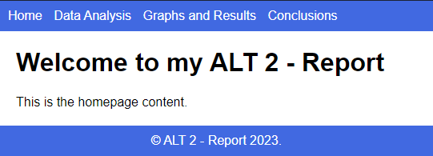
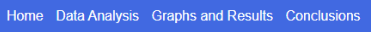

# Report Template - ALT 2



## Instructions 📚

1. Please add comments to all of the elements in ``index.html``, explaining what they do.
````html
<!-- This is how we comment in HTML -->
````
2. Experiment with the different values & parameters to see what changes.

## Task 👨‍💻
Edit & use the template given to re-write your ALT 2 Report as a 4-page website.

1. It must have 4 pages

    - Home
    - Data Analysis
    - Graphs and Results
    - Conclusions
2. Each page must include a `navigation bar` at the  top.



3. Remember to name your pages correctly:

    - ``data_analysis.html``
    - ``graphs_results.html``
    - ``conclusions.html``

4. Remember, our Home Page must remain as `index.html`.


  
